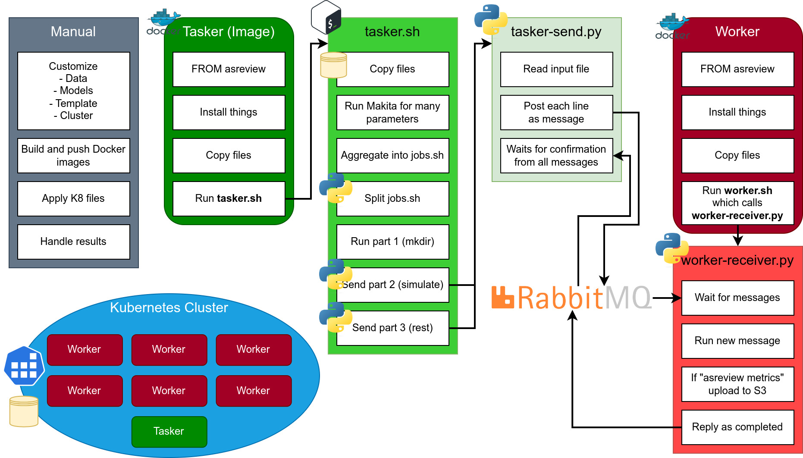

# asreview-cloud

In this repository, we keep files used to run (very) large simulations in parallel in the cloud.
The approach we use here is to run a Kubernetes cluster, and send individual simulation commands to different workers.
This assumes that you already know how to run simulations with [Makita](https://github.com/asreview/asreview-makita).

This documentation should help you get Kubernetes installed locally on a Linux machine or on SURF, and to run some examples of simulations.
For more advanced usage, for instance, using an existing Kubernetes cluster, we provide no official support, but the community might have some tips.

## Explanation

The basic explanation of how this work is: one core of the machine reads the `jobs.sh` Makita file and sends each line to a different core of the machine.

The more convoluted explanation is below:

- We have various _worker_ pods.
- We have a _tasker_ pod.
- The tasker runs a **shell file** (`tasker.sh`) that prepares the ground for the workers and then sends work for the workers.
  - This file can be heavilly modified by the user, to handle specific use cases.
- One possible script is `python tasker-send.py FILE`, which send each line of the `FILE` to the workers as message through RabbitMQ.
  - If you don't use `tasker-send.py`, there is no parallel execution of the tasks.
- The worker receives the message and runs it as a shell command.
- When the worker completes the command, it sends a message back to the `tasker-send.py`, so it can keep track of what was executed.
- `tasker-send.py` will block the execution of further commands until `FILE` is completed.
- Another possible command is `python split-file.py FILE`, which reads the `FILE` and creates three new files:
  - `FILE.part1` contains every command with "mkdir" and "describe", and everything before the first `simulate` line.
  - `FILE.part2` contains every `simulate` line.
  - `FILE.part3` contains every other command.
- The most basic workflow is to take the Makita `jobs.sh`, split it into three, run the first part directly with the tasker (to create folders), then send the second part with `tasker-send.py`, and finally send the third part as well.

The visual representation (which is not very helpful by itself) is below:



## Installing locally

Install `minikube` from your package provider or look into the [official documentation](https://minikube.sigs.k8s.io/docs/start/).

You should have the `kubectl` command as well.

## Install on SURF

Create a workspace with "Ubuntu 20.04 (SUDO enabled)".

Install docker following [the official documentation](https://docs.docker.com/engine/install/ubuntu/).
At the time of writing, the commands are:

```bash
sudo apt-get update
sudo apt-get install ca-certificates curl gnupg
sudo install -m 0755 -d /etc/apt/keyrings
curl -fsSL https://download.docker.com/linux/ubuntu/gpg | sudo gpg --dearmor -o /etc/apt/keyrings/docker.gpg
sudo chmod a+r /etc/apt/keyrings/docker.gpg
echo \
  "deb [arch="$(dpkg --print-architecture)" signed-by=/etc/apt/keyrings/docker.gpg] https://download.docker.com/linux/ubuntu \
  "$(. /etc/os-release && echo "$VERSION_CODENAME")" stable" | \
  sudo tee /etc/apt/sources.list.d/docker.list > /dev/null
sudo apt-get update
sudo apt-get install docker-ce docker-ce-cli containerd.io docker-buildx-plugin docker-compose-plugin
```

Then, add your user to the docker group:

```bash
sudo usermod -aG docker $USER
```

Log out and log in again. Test that you can run `docker run hello-world`.

Download minikube and install it.
Following the [official documentation](https://minikube.sigs.k8s.io/docs/start/) at the time of writing, you can run:

```bash
curl -LO https://storage.googleapis.com/minikube/releases/latest/minikube_latest_amd64.deb
sudo dpkg -i minikube_latest_amd64.deb
```

Install `kubectl` following the [official documentation](https://kubernetes.io/docs/tasks/tools/install-kubectl-linux/#install-using-native-package-management), **however, fix the curl command** following [this issue](https://github.com/kubernetes/release/issues/2862):

```bash
sudo apt-get update
sudo apt-get install -y ca-certificates curl
# sudo curl -fsSLo /etc/apt/keyrings/kubernetes-archive-keyring.gpg https://packages.cloud.google.com/apt/doc/apt-key.gpg
sudo curl -fsSLo /etc/apt/keyrings/kubernetes-archive-keyring.gpg https://dl.k8s.io/apt/doc/apt-key.gpg
echo "deb [signed-by=/etc/apt/keyrings/kubernetes-archive-keyring.gpg] https://apt.kubernetes.io/ kubernetes-xenial main" | sudo tee /etc/apt/sources.list.d/kubernetes.list
sudo apt-get update
sudo apt-get install -y kubectl
```

You can install bash completions using

```bash
kubectl completion bash | sudo tee /etc/bash_completion.d/kubectl > /dev/null
```

Log out and log in after installing bash completions.

## Start minikube and install RabbitMQ

We need to install and run RabbitMQ on Kubernetes.
Run the following commands takes from [RabbitMQ Cluster Operator](https://www.rabbitmq.com/kubernetes/operator/quickstart-operator.html), and then the `rabbitmq.yml` service.

```bash
minikube start --cpus CPU_NUMBER --memory HOW_MUCH_MEMORY
kubectl apply -f "https://github.com/rabbitmq/cluster-operator/releases/latest/download/cluster-operator.yml"
```

The `CPU_NUMBER` argument is the number of CPUs you want to dedicate to `minikube`.
The `HOW_MUCH_MEMORY` argument is how much memory.

> **Note**
>
> If you are on SURF, you found these values when creating the machine.

## Clone this repo

If you haven't already, clone this repo and enter it's folder:

```bash
git clone https://github.com/abelsiqueira/asreview-cloud
cd asreview-cloud
```

From here on, we will need files inside the `asreview-cloud` repo.

## Start RabbitMQ configuration

Run

```bash
kubectl apply -f rabbitmq.yml
```

## Create a volume

The volume is necessary to hold the `data`, `scripts`, and the `output`.

```bash
minikube ssh -- sudo mkdir -p /mnt/asreview-storage
kubectl apply -f volume.yml
```

The volume contains a `StorageClass`, a `PersistentVolume`, and a `PersistentVolumeClaim`.
It uses a local storage inside `minikube`, and it assumes that **2 GB** are sufficient for the project.

## Prepare the tasker script and Docker image

The `tasker.sh` defines everything that will be executed by the tasker, and indirectly by the workers.
The `tasker.Dockerfile` will create the image that will be executed in the tasker pod.
You can modify these as you see fit.
After you are done, compile and push the image:

> **Warning**
>
> The default tasker assumes that a data folder exists with your data.
> Make sure to either provide the data or change the tasker and Dockerfile.

```bash
docker build -t YOURUSER/tasker -f tasker.Dockerfile .
docker push YOURUSER/tasker
```

> **Note**
>
> This will push the image to Docker. You will need to create an account an login in your terminal with `docker login`.

## Prepare the worker script and Docker image

The `worker.sh` defines a very short list of tasks: running `worker-receiver.py`.
You can do other things before that, but tasks that are meant to be run before **all** workers start working should go on `tasker.sh`.
The `worker-receiver.py` runs continuously, waiting for new tasks from the tasker.

```bash
docker build -t YOURUSER/worker -f worker.Dockerfile .
docker push YOURUSER/worker
```

## Running the workers

The file `worker.yml` contains the configuration of the deployment of the workers.
Change the `image` to reflect the path to the image that you pushed.
You can select the number of `replicas` to change the number of workers.
Pay attention to the resource limits, and change as you see fit.

Run with

```bash
kubectl apply -f worker.yml
```

Check that the workers are running with the following:

```bash
kubectl get pods
```

You should see some `asreview-worker-FULL-NAME` pods with "Running" status after a while.
Follow the logs of a single pod with

```bash
kubectl logs asreview-worker-FULL-NAME -f
```

You should see something like

```plaintext
Logging as ...
[*] Waiting for messages. CTRL+C to exit
```

## Running the tasker

Similarly, the `tasker.yml` allows you to run the tasker as a Kubernetes job.
Change the `image`, and optionally add a `ttlSecondsAfterFinished` to auto delete the task - I prefer to keep it until I review the log.
Run

```bash
kubectl apply -f tasker.yml
```

Similarly, you should see a `tasker` pod, and you can follow its log.

## Copying the output out of the minikube to your machine

You can copy the `output` folder from the volume with

```bash
kubectl cp asreview-worker-FULL-NAME:/app/workdir/output ./output
```

Also, check the `/app/workdir/issues` folder.
It should be empty, because it contains errors while running the simulate code.
If it is not empty, the infringing lines will be shown.

## Deleting and restarting

If you plan to make modifications to the tasker or the worker, they have to be deleted, respectivelly.

The workers keep running after the tasker is done.
They don't know when to stop.
To stop and delete them, run

```bash
kubectl delete -f worker.yml
```

If you did not set a `ttlSecondsAfterFinished` for the tasker, it will keep existing, although not running.
You can delete it the same way as you did the workers, but using `tasker.yml`.

You can then delete the `volume.yml` and the `rabbit.yml`, but if you are running new tests, you don't need to.

Since the volume is mounted in the minikube, you don't lose the data, and you can run the workers again and inspect or copy them out, if you forgot.
You will lose the execution log, though.

If you want to delete everything in the volume as well, you can run

```bash
minikube ssh -- sudo rm -rf /mnt/asreview-storage/*
```

Running everything again is simply a matter of using `kubectl apply` again.
Of course, if you modify the `.sh` or `.py` files, you have to build the corresponding docker image again.

> **Warning**
>
> The default **tasker** deletes the whole workdir folder to make sure that it is clean when it starts.
> If you don't want this behaviour, look for the "rm -rf" line and comment it out or remove it.
> However, if you run into a "Project already exists" error, this is why.

## Troubleshooting and FAQ

### After running the tasker, the workers are in CrashLoopBackOff/Error

Probably some command in the tasker resulted in the worker failure, and now the queue is populated and the worker keep trying and failing.
Looking at the logs of the worker should give insight in the real issue.

To verify if you have a queue issue, run

```bash
kubectl exec rabbitmq-server-0 -- rabbitmqctl list_queues
```

If any of the queues has more than 0 messages, then this confirms the issue.
Delete the queue with messages:

```bash
kubectl exec rabbitmq-server-0 -- rabbitmqctl delete_queue asreview_queue
```

You should see the workers go back to "Running" state.
